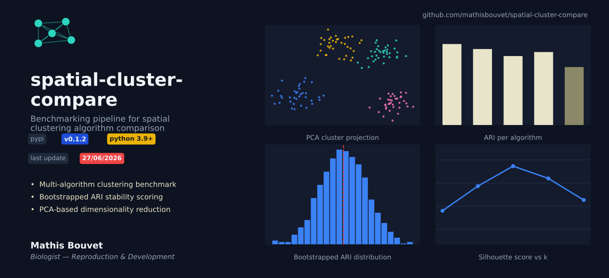
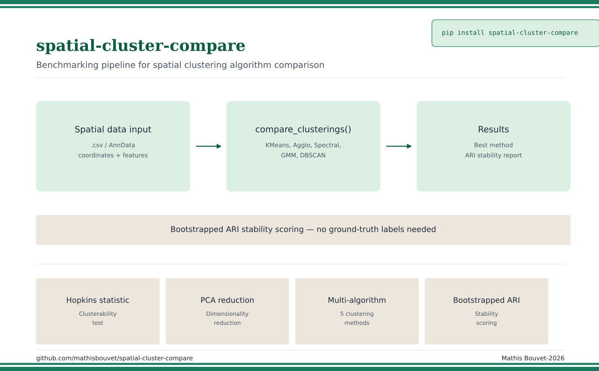

# spatial-cluster-compare

[](https://github.com/mathisbouvet/spatial-cluster-compare/actions/workflows/tests.yml)
[](https://pypi.org/project/spatial-cluster-compare/)
[](LICENSE)

Automated clustering algorithm comparison pipeline for spatial proteomics,
cytometry data, or any numerical feature table.

Originally an analysis notebook, restructured into a tested, reusable Python package.



## Table of contents

- [Why this package](#why-this-package)
- [Part of MACSima_Spatial-Omics-Pipeline](#part-of-macsima_spatial-omics-pipeline)
- [What the pipeline does](#what-the-pipeline-does)
- [Installation](#installation)
- [Quick usage](#quick-usage)
- [Advanced usage (step by step)](#advanced-usage-step-by-step)
- [Expected data format](#expected-data-format)
- [Roadmap](#roadmap)

## Why this package

Choosing a clustering algorithm is often an arbitrary decision: KMeans gets
picked by default, parameters get tuned until the result "looks right," and
the choice is rarely backed by an objective comparison. For biological data in
particular where clusters are expected to reflect real cell populations
this matters: the wrong algorithm or the wrong number of clusters can produce
plausible-looking but biologically meaningless groups.

`spatial-cluster-compare` runs several clustering algorithms on the same data,
scores each one on multiple complementary metrics (including bootstrap
stability, not just a single internal index), and picks the best method
through a transparent, reproducible composite score — instead of relying on a
single, unverified default choice.

## Part of MACSima_Spatial-Omics-Pipeline

`spatial-cluster-compare` is one of the packages of
[**MACSima_Spatial-Omics-Pipeline**](https://github.com/mathisbouvet/MACSima_Spatial-Omics-Pipeline),
which centralizes the protocols (detailed, step-by-step documentation) and
notebooks (original, standalone analyses) for the whole pipeline.

| Resource | Link |
|---|---|
| Protocol (detailed documentation, data format, formulas) | [`protocols/02_spatial_cluster_compare.md`](https://github.com/mathisbouvet/MACSima_Spatial-Omics-Pipeline/blob/main/protocols/02_spatial_cluster_compare.md) |
| Original notebook | [`notebooks/cluster/02_spatial_cluster_compare.ipynb`](https://github.com/mathisbouvet/MACSima_Spatial-Omics-Pipeline/blob/main/notebooks/cluster/02_spatial_cluster_compare.ipynb) |

## What the pipeline does

1. **Clusterability test** (Hopkins statistic) before/after normalization
2. **Conditional normalization**: StandardScaler applied only if it improves cluster structure
3. **Dimensionality reduction** (PCA, configurable explained variance)
4. **Automatic selection of k** via a composite score (Silhouette, Davies-Bouldin, Calinski-Harabasz)
5. **Multi-algorithm benchmark**: KMeans, Agglomerative, Spectral, GMM, DBSCAN (eps auto-estimated via the elbow method)
6. **Bootstrap stability** (mean ARI) for each method
7. **Automatic selection of the best method** based on a normalized composite score
8. **Visualizations**: comparative bar chart of metrics, mean-expression heatmap per cluster

<p align="center">
  
</p>

## Installation

- Python 3.9+
- Dependencies (`numpy`, `pandas`, `scikit-learn`, `scipy`, `matplotlib`, `seaborn`) are installed automatically.

```bash
pip install spatial-cluster-compare
```

For a local/development install:

```bash
pip install -e .
```

## Quick usage

The fastest way to get a result: load your data, run the full comparison, plot it.

```python
import pandas as pd
from spatial_cluster_compare import compare_clusters, plot_comparison_bars, plot_cluster_heatmap

data = pd.read_csv("Cluster_ImmuneCell.csv")
result = compare_clusters(data)

print(result.results_df)
print(f"Best method: {result.best_method}")

plot_comparison_bars(result.results_df)
plot_cluster_heatmap(result.X_original, result.best_labels, method_name=result.best_method)
```

## Advanced usage (step by step)

For control over each stage of the pipeline (scaling, PCA, choice of k, benchmark) instead of the single `compare_clusters` call above:

```python
from spatial_cluster_compare import (
    auto_scale, find_best_k, run_benchmark, select_best_method
)
from sklearn.decomposition import PCA

X = data.select_dtypes(include=["float64", "int64"])
X_best, report = auto_scale(X)

pca = PCA(n_components=0.9)
X_reduced = pca.fit_transform(X_best)

optimal_k, k_results = find_best_k(X_reduced, range(2, 10))

results_df, labels_per_method = run_benchmark(X_reduced, optimal_k=optimal_k)
best_method, best_labels = select_best_method(results_df, labels_per_method)
```

## Expected data format

- **One row per cell**, one column per marker/descriptor. Numeric columns are
  used automatically as clustering features; non-numeric columns (ID, ROI
  name...) are ignored automatically.
- **Drop non-biological numeric columns** before calling `compare_clusters`
  (e.g. `Cell_ID`, centroid coordinates), or they'll be wrongly included:
  ```python
  data = data.drop(columns=["Cell_ID", "Centroid X", "Centroid Y"])
  ```
- **Missing values (NaN)** aren't handled automatically — clean (`data.dropna()`)
  or impute beforehand.
- **Dataset size**: plan for at least a few hundred cells for a reliable
  Hopkins statistic and ARI bootstrap. Spectral Clustering can get slow
  beyond ~10-20k rows.

Full details (MACSiQView export settings, column naming pitfalls, biological
rationale for each step) are in the
[protocol](https://github.com/mathisbouvet/MACSima_Spatial-Omics-Pipeline/blob/main/protocols/02_spatial_cluster_compare.md).

## Roadmap

- Automatic PDF/figure export of the comparison report
- Support for multi-batch datasets (clustering comparison across runs)
- CLI (`spatial-cluster-compare run data.csv`)